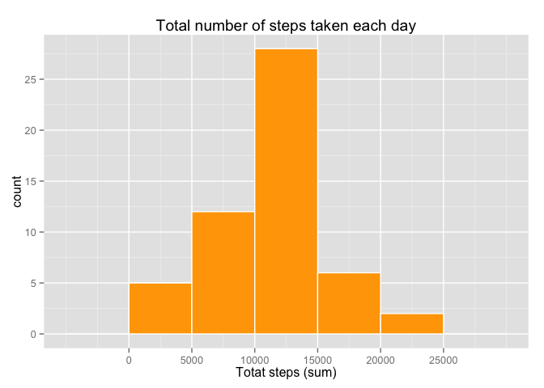
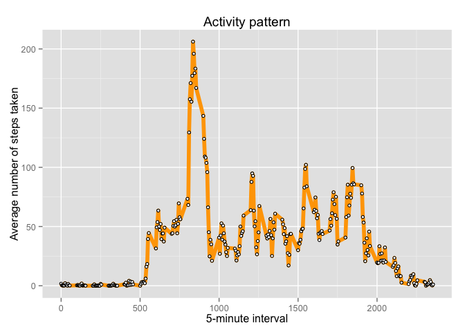
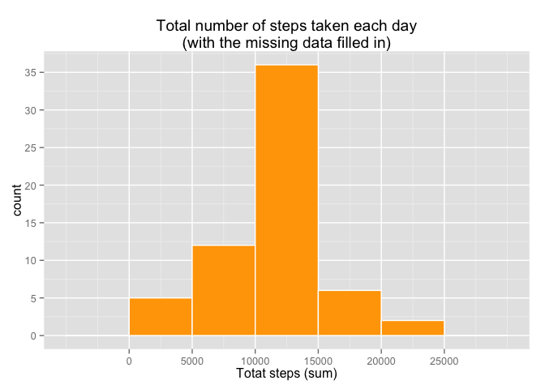
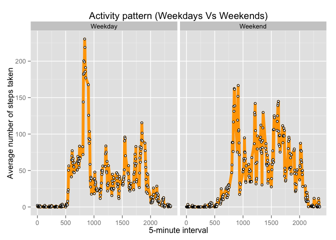

# Reproducible Research: Peer Assessment 1

## Loading de required packages

```r
library(dplyr, quietly = T, warn.conflicts = F)
library(lubridate, quietly = T, warn.conflicts = F)
library(scales, quietly = T, warn.conflicts = F)
library(ggplot2, quietly = T, warn.conflicts = F)
```

## Loading and preprocessing the data

```r
if(!file.exists("activity.csv")) {
  if(!file.exists("activity.zip")) {
      download.file(url="https://d396qusza40orc.cloudfront.net/repdata%2Fdata%2Factivity.zip", 
                    destfile="activity.zip",
                    method="curl")
    }
  unzip("activity.zip")
  }
  activity <- read.csv("activity.csv", 
                       header = TRUE, 
                       sep = ",",
                       na.strings="NA")
```

## What is mean total number of steps taken per day?

For this part of the assignment, the missing values in the dataset are ignored.

***1. Make a histogram of the total number of steps taken each day***


```r
totalStepsByDay <- activity %>%
  select(steps, date) %>%
  group_by(date) %>%
  summarize(totalSteps = sum(steps))

ggplot(totalStepsByDay) + 
  aes(x=totalSteps) +
  ggtitle("Total number of steps taken each day") + 
  xlab("Totat steps (sum)") +
  scale_x_continuous(breaks = seq(0, 25000, by = 5000)) +
  scale_y_continuous(breaks = seq(0, 40, by = 5)) +
  geom_histogram(binwidth = 5000, fill = "orange", color = "white")
```

 

***2. Calculate and report the mean and median total number of steps taken per day***

2.1. Mean total number of steps taken per day:


```r
mean(totalStepsByDay$totalSteps, na.rm = T)
```

```
## [1] 10766.19
```

2.2 Median total number of steps taken per day:


```r
median(totalStepsByDay$totalSteps, na.rm = T)
```

```
## [1] 10765
```

## What is the average daily activity pattern?

***1. Make a time series plot (i.e. `type = "l"`) of the 5-minute interval (x-axis) and the average number of steps taken, averaged across all days (y-axis)***


```r
stepsMeanByInterval <- activity %>%
  select(interval, steps) %>%
  group_by(interval) %>%
  summarize(stepMean = mean(steps, na.rm = T))

ggplot(stepsMeanByInterval) + 
  aes(x=interval, y=stepMean) +
  ggtitle("Activity pattern") + 
  xlab("5-minute interval") +
  ylab("Average number of steps taken") +
  geom_line(size=2, color = "orange") + 
  geom_point(size=1.5, shape=21, fill="white")
```

 

***2. Which 5-minute interval, on average across all the days in the dataset, contains the maximum number of steps?***


```r
stepsMeanByInterval[stepsMeanByInterval$stepMean == max(stepsMeanByInterval$stepMean),]$interval
```

```
## [1] 835
```

## Imputing missing values

Note that there are a number of days/intervals where there are missing values (coded as `NA`). The presence of missing days may introduce bias into some calculations or summaries of the data.

***1. Calculate and report the total number of missing values in the dataset (i.e. the total number of rows with `NA`s)***


```r
sum(is.na(activity))
```

```
## [1] 2304
```


***2. Devise a strategy for filling in all of the missing values in the dataset. The strategy does not need to be sophisticated. For example, you could use the mean/median for that day, or the mean for that 5-minute interval, etc.***

for every NA step value, replace with the corresponding interval mean value calculated above (stepsMeanByInterval)


```r
fill.missing <- function(activity,stepsMeanByInterval) {
  for (i in 1:nrow(activity)) {
    if(is.na(activity$steps[i])) {
      interval <- activity$interval[i]
      activity$steps[i] <-stepsMeanByInterval[stepsMeanByInterval$interval==interval, ]$stepMean
    }
  }
  return(activity)
}
```

***3. Create a new dataset that is equal to the original dataset but with the missing data filled in.***

```r
activity.new <- fill.missing(activity,stepsMeanByInterval)
```

***4. Make a histogram of the total number of steps taken each day***


```r
totalStepsByDay.new <- activity.new %>%
  select(steps, date) %>%
  group_by(date) %>%
  summarize(totalSteps = sum(steps))

ggplot(totalStepsByDay.new) + 
  aes(x=totalSteps) +
  ggtitle("Total number of steps taken each day\n(with the missing data filled in)") + 
  xlab("Totat steps (sum)") +
  scale_x_continuous(breaks = seq(0, 25000, by = 5000)) +
  scale_y_continuous(breaks = seq(0, 40, by = 5)) +
  geom_histogram(binwidth = 5000, fill = "orange", color = "white")
```

 

***5. Calculate and report the mean total number of steps taken per day. ***


```r
mean(totalStepsByDay.new$totalSteps, na.rm = F)
```

```
## [1] 10766.19
```

***6. Calculate and report the median total number of steps taken per day.***


```r
median(totalStepsByDay.new$totalSteps, na.rm = F)
```

```
## [1] 10766.19
```

***7.Do these values differ from the estimates from the first part of the assignment? What is the impact of imputing missing data on the estimates of the total daily number of steps?***

The values differ a little. Then mean remain the same whereas there is slight change in median value.

## Are there differences in activity patterns between weekdays and weekends?

For this part the `weekdays()` function may be of some help here. Use
the dataset with the filled-in missing values for this part.

***1. Create a new factor variable in the dataset with two levels -- "weekday" and "weekend" indicating whether a given date is a weekday or weekend day.***


```r
activity.new$wday <-sapply(activity.new$date, function(x) if(wday(as.Date(x))>1 & wday(as.Date(x))<7) return("Weekday") else return("Weekend"))
```

***2. Make a panel plot containing a time series plot (i.e. `type = "l"`) of the 5-minute interval (x-axis) and the average number of steps taken, averaged across all weekday days or weekend days (y-axis).***


```r
stepsMeanByInterval.new <- activity.new %>%
  select(interval, steps, wday) %>%
  group_by(interval,wday) %>%
  summarize(stepMean = mean(steps, na.rm = T))

ggplot(stepsMeanByInterval.new) + 
  aes(x=interval, y=stepMean) +
  ggtitle("Activity pattern (Weekdays Vs Weekends)") + 
  xlab("5-minute interval") +
  ylab("Average number of steps taken") +
  geom_line(size=2, color = "orange") +
  facet_grid(. ~ wday) + 
  geom_point(size=1.5, shape=21, fill="white")
```

 


